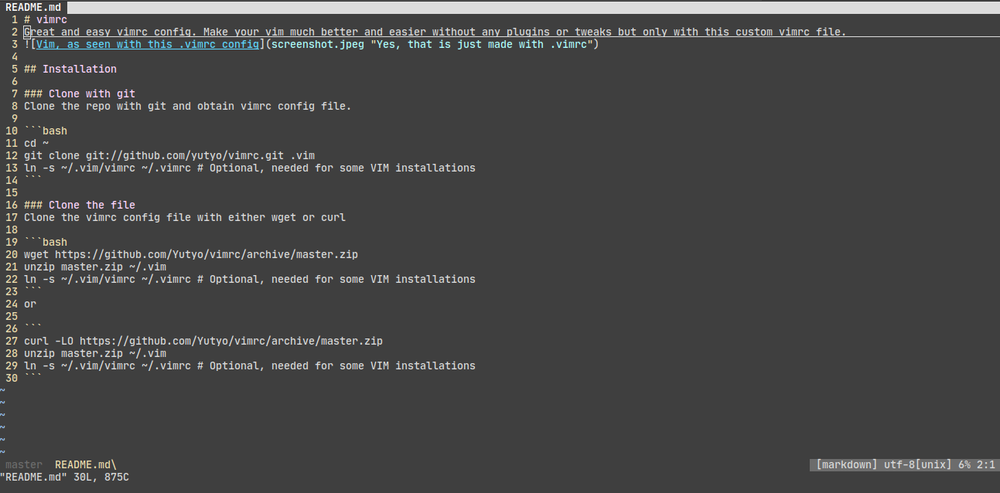

# vimrc
Great .vimrc config. Make your vim function and look better without any plugins but only with built-in config settings.


## Installation

### Clone with git
Clone the repo with git and obtain .vimrc config file.

```bash
cd ~
git clone git://github.com/yutyo/vimrc.git .vim
ln -s ~/.vim/vimrc ~/.vimrc # Optional, needed for some VIM installations
```

### Clone the file
Clone the .vimrc config file with either wget or curl

```bash
wget https://github.com/Yutyo/vimrc/archive/master.zip
unzip master.zip ~/.vim
```


